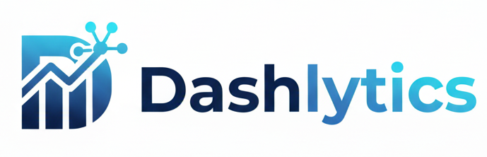

<p align="center">
  
</p>

<h1 align="center">Dashlytics</h1>

<p align="center">
  <h1>AI-Driven Data Analytics & Reporting Platform</h1>
</p>


## 📌 Overview

Dashlytics is an AI-powered data analytics platform that automates the complete workflow of data analysis, including data preprocessing, visualization, machine learning, and report generation. It enables users to upload datasets, derive insights, and generate professional PDF reports with minimal manual effort.

---

## 🎯 Features

* 📊 Automated Data Cleaning & Preprocessing
* 📈 Interactive Dashboards (Plotly)
* 🤖 Machine Learning Models (Regression & Classification)
* 🧠 AI-Generated Analytical Reports
* 📄 PDF Report Generation with Charts
* 💾 Dataset Management

---

## ⚙️ Tech Stack

* **Frontend:** Streamlit
* **Backend:** Python
* **Data Processing:** Pandas, NumPy
* **Visualization:** Plotly
* **Machine Learning:** Scikit-learn
* **Database:** SQLite
* **AI Integration:** OpenRouter API (LLMs)
* **Report Generation:** ReportLab

---

## 🧠 Algorithms Used

* Data Preprocessing (Handling missing values, transformations)
* Exploratory Data Analysis (Statistical methods)
* Linear Regression
* Decision Tree Classifier (CART with Gini Impurity)
* Model Evaluation (Accuracy Score, Mean Squared Error)

---

## 🔄 Workflow

1. Upload dataset
2. Perform data cleaning
3. Generate statistical insights
4. Create interactive visualizations
5. Train and evaluate ML models
6. Generate AI-based insights
7. Export professional PDF report

---

## 📸 Application Preview

<p align="center">
<h1 align="center">Welcome Page</h1>

</p>
<p align="center">
<h1 align="center">Data Cleaning</h1>

</p>
<p align="center">
<h1 align="center">Models</h1>

</p>
<p align="center">
<h1 align="center">Dashboard</h1>

</p>
<p align="center">
<h1 align="center">Report Generation</h1>

</p>

---

## 🛠️ Installation

### 1. Clone the repository

```bash
git clone https://github.com/Rakesh-B-Stud/Dashlytics.git
cd Dashlytics
```

### 2. Create virtual environment (optional)

```bash
python -m venv myenv
myenv\Scripts\activate
```

### 3. Install dependencies

```bash
pip install -r requirements.txt
```

### 4. Setup environment variables

Create a `.env` file:

```env
OPENROUTER_API_KEY=your_api_key_here
```

### 5. Run the app

```bash
streamlit run app.py
```

---

## 🌐 Deployment

* Compatible with **Render**, **Streamlit Cloud**
* Requires **Chromium/Chrome** for Plotly image export (Kaleido)

---

## ⚠️ Common Issues

### Charts not appearing in PDF

```bash
pip install kaleido
```

### Kaleido Chrome Error (Render)

Use `render.yaml` to install Chromium.

---

## 🚧 Future Enhancements

* Real-time data processing
* Advanced ML models
* Multi-user authentication
* Cloud deployment
* Custom dashboards

---

## 👨‍💻 Author

**Rakesh B**
📧 [rakesh.b10a@gmail.com](mailto:rakesh.b10a@gmail.com)
🔗 https://linkedin.com/in/rakeshbhaskarrao/
💻 https://github.com/Rakesh-B-Student

---

## ⭐ Contribution

Contributions are welcome! Feel free to fork and improve the project.

---

## 📄 License

This project is developed for academic and learning purposes.
